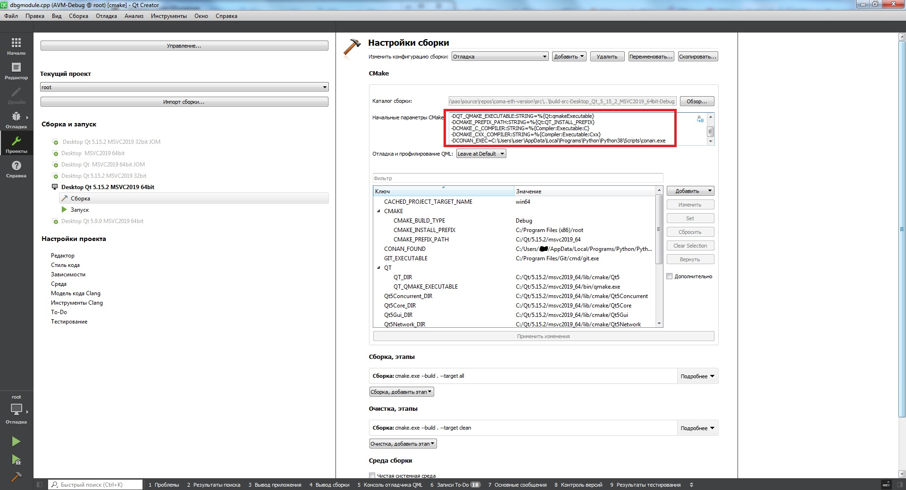

[](https://app.codacy.com/gh/Jihadist/coma?utm_source=github.com&utm_medium=referral&utm_content=Jihadist/coma&utm_campaign=Badge_Grade_Settings)
| OS | Status | Download |
|----------|--------|----------|
| Windows x64 | [](http://172.16.31.73:27015/buildConfiguration/Coma_WindowsBuild_Develop_BuildX64) | [Download](file://///Rserver/av-tuk/SOFT/AVTUK-S/) |
| Windows x86 | [](http://172.16.31.73:27015/buildConfiguration/Coma_WindowsBuild_Develop_BuildX86) | [Download](file://///Rserver/av-tuk/SOFT/AVTUK-S/) |
| Linux (Debian 10) x64 | [](http://172.16.31.73:27015/buildConfiguration/Coma_LinuxBuild_Develop_BuildX64) | [Download](file://///Rserver/av-tuk/SOFT/AVTUK-S/) |
| Linux (Debian 10) armv7 | [](http://172.16.31.73:27015/admin/editBuildRunners.html?id=buildType:Coma_LinuxBuild_AliseZero_BuildArmv7a) | [Download](file://///Rserver/av-tuk/SOFT/AVTUK-S/) |

# Requires  

- Python - https://www.python.org/ (for pip)
- Python-pip - https://pypi.org/project/pip/ (for conan)
- conan - https://conan.io/downloads.html (can be installed with python-pip)
- Qt 5.15.2 fully supported, a minimal functional can compiled with Qt 5.11.1 - https://www.qt.io/ 
- C++ compiler with full C++17 support (MSVC 2019 - 16.10+, gcc 9.3.0+, clang-11+)

C++ language feature support you can check here

MSVC - https://docs.microsoft.com/en-us/cpp/overview/visual-cpp-language-conformance?view=msvc-160

Others - https://en.cppreference.com/w/cpp/compiler_support

- boost/header_only - conan
- LimeReport - submodule
- QXlsx - submodule
- hidapi - conan if Windows, system package if Linux
- ctti - inside project tree because project was abandoned
- qcustomplot - inside project tree
- protobuf - conan
- zeromq - conan

# Build 
How to initialize conan, just run command in repository root folder


```bash
$ mkdir build && cd build
$ cmake [<options>] ../src 
```


supported options:
- cmake  
  - CMAKE_TOOLCHAIN_FILE - custom toolchain file if needed
  - CMAKE_BUILD_TYPE - build type of course
  - CMAKE_INSTALL_PREFIX=install_prefix - prefix for cmake --build --target install
  - CMAKE_PREFIX_PATH:STRING=path_to_qt - path to Qt location, for example C:\Qt\5.15.2\msvc2019

- git 
  - COMMIT_COUNT - output of command ```git rev-list --count HEAD```, neccessary if you don't have git in PATH or you don't have git locally
  - SHORT_HASH - output of command ```git rev-parse --short"="8 HEAD```, neccessary if you don't have git in PATH or you don't have git locally
- cpack
  - CPACK_PACKAGING_INSTALL_PREFIX=/usr/local - prefix for installed files (now ony for deb packages)
- conan
  - CONAN_EXEC=path_to_conan - neccessary if conan is not in PATH
  - USER_DIRECTORY=user_directory - neccessary if you want to use non default conan directory, provide path contains .conan folder
- other 
  - A x64/Win32 - used to change target arch only with Visual Studio cmake generator, ninja uses only provided compilers
  - BUILD_WITH_ALISE:BOOL=ON (off by default) - do u wanna build Alise? Use only if you know her.
  - ENABLE_EMULATOR:BOOL=ON (off by default) - coma'll be built with dummy interface, it can be used without real device 
  ```$ cmake --build . [<options>]```

supported options for multi-config generators:
- config Release/Debug

```$ cmake --install . [<options>]```

supported options for multi-config generators same as for build step


#### Supported architectures
|       | x86  | x86_64 | armv7    |
| ----- | ---- | ------ | -------- |
| core  | +    | +      | +        |
| gui   | +    | +      | -        |
| avtuk | +    | +      | only CCU |

Non gui parts can be compiled for x86 (i386, win32), x86_64 (amd64, win64), armv7(armv7a, armhf)

#### How to provide cmake options in QtCreator 

For example, if you want to provide path to conan executable ```CONAN_EXEC``` , you need to append -DCONAN_EXEC=path_to_conan to cmake configure command (look at image).



